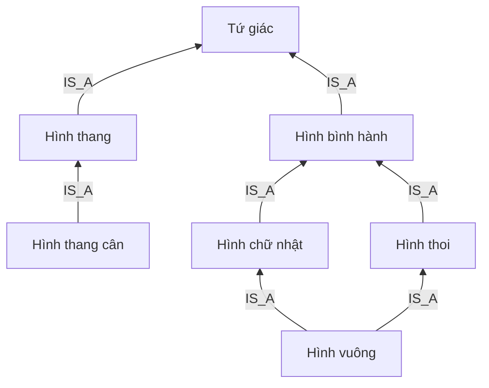
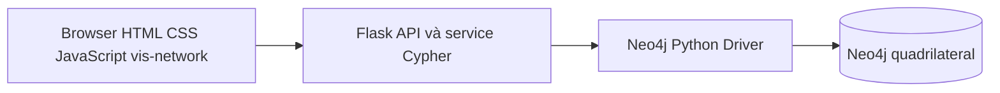
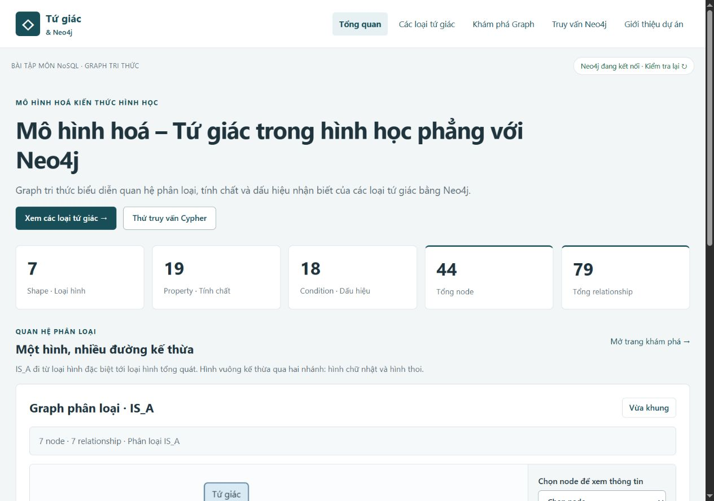
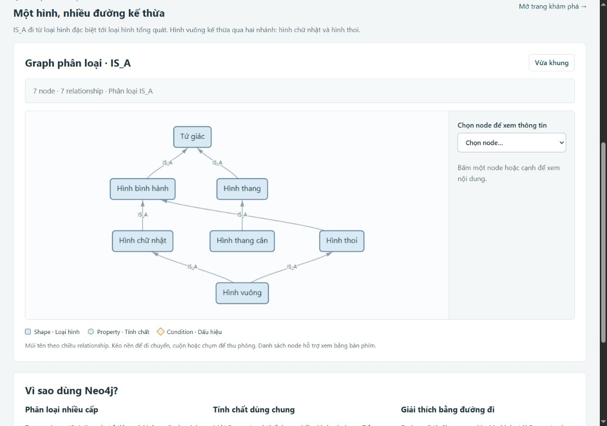

# Mô hình hoá – Tứ giác trong hình học phẳng với Neo4j

## 1. Giới thiệu

Dự án môn NoSQL mô hình hoá kiến thức về bảy loại tứ giác bằng Neo4j. Ứng dụng Flask tiếng Việt tra cứu định nghĩa, tính chất kế thừa, dấu hiệu nhận biết và hiển thị graph trên web. Data + Source App đã kiểm thử thực tế; hai tài liệu Word ở `docs/`.

Repository: [phi1411/neo4j](https://github.com/phi1411/neo4j). Kiểm tra cuối và các mục cần điền trước khi nộp ở [FINAL_CHECK.md](docs/FINAL_CHECK.md).

## 2. Mục tiêu

- Biểu diễn phân loại nhiều cấp và đa kế thừa của hình vuông.
- Dùng chung Property và giải thích nguồn tính chất bằng đường đi.
- Mô hình hoá AND trong một Condition, OR giữa các Condition.
- Chạy 15 query Cypher và trực quan hoá kết quả thật.

## 3. Bài toán

Hình vuông vừa là hình chữ nhật vừa là hình thoi. Khi tổng hợp tính chất cần duyệt hai nhánh IS_A và loại trùng; khi giải thích tính chất chia đôi đường chéo cần giữ hai đường tới hình bình hành. Ứng dụng tra cứu tri thức của **loại hình**, chưa nhập số đo hoặc nhận dạng hình cụ thể.

## 4. Vì sao chọn Neo4j

Các relationship biểu diễn phân loại, khai báo tính chất và giả thiết nhận biết. Cypher diễn đạt traversal nhiều cấp, giao tập tính chất và đường giải thích bằng pattern. Một Property có thể thuộc nhiều nhánh; hình vuông có hai cha mà không cần sao chép tính chất.

SQL cũng có thể mô hình hoá bằng bảng liên kết và truy vấn đệ quy. Dự án minh hoạ graph và traversal, **không có benchmark hoặc kết luận Neo4j nhanh hơn SQL**.

## 5. Phạm vi hình học và quy ước

Xét tứ giác lồi, phẳng, không suy biến; đỉnh A, B, C, D theo thứ tự trên biên. Dataset gồm Tứ giác, Hình thang, Hình thang cân, Hình bình hành, Hình chữ nhật, Hình thoi, Hình vuông.

**Hình thang có đúng một cặp cạnh đối song song.** Đây là quy ước taxonomy của project để tách nhánh hình thang khỏi hình bình hành. Tài liệu dùng “ít nhất một cặp” sẽ có hệ phân loại khác. Hình chữ nhật và hình thoi bao gồm hình vuông.

## 6. Mô hình graph

Node có nhãn chung `ProjectEntity`, dataset `quadrilateral-v1` và một nhãn miền:

| Node | Số lượng | Vai trò |
|---|---:|---|
| Shape | 7 | Tên loại hình, định nghĩa, tên tìm kiếm |
| Property | 19 | Mệnh đề hình học, nhóm, mô tả, ký hiệu |
| Condition | 18 | Một dấu hiệu đủ độc lập, logic AND, giải thích |

| Relationship | Số lượng | Chiều và ý nghĩa |
|---|---:|---|
| IS_A | 7 | Shape → Shape tổng quát |
| HAS_PROPERTY | 17 | Shape → Property khai báo trực tiếp |
| HAS_CONDITION | 18 | Shape kết luận → Condition |
| REQUIRES_SHAPE | 18 | Condition → Shape ngữ cảnh |
| REQUIRES_PROPERTY | 19 | Condition → Property giả thiết |

Tổng **44 node, 79 relationship**. ID ổn định theo `(dataset,id)`; ba uniqueness constraints và một index tìm kiếm, ngoài backing indexes. Chỉ lưu phân loại và Property trực tiếp. HV không có HAS_PROPERTY trực tiếp nhưng có 12 Property hiệu lực qua traversal.

C_HV_01: **HCN AND ADJACENT_SIDES_EQUAL ⇒ HV**. C_HV_05: **TQ AND FOUR_EQUAL_SIDES AND FOUR_RIGHT_ANGLES ⇒ HV**. Hai quy tắc là lựa chọn OR. Condition không được kế thừa như Property.

## 7. Taxonomy



Không có HBH IS_A HT hoặc HCN IS_A HTC. Tổ tiên HV: HCN, HTHOI, HBH, TQ; không HT/HTC. HCN và HTC khai báo đường chéo bằng nhau độc lập; chia sẻ Property không suy ra IS_A.

## 8. Kiến trúc hệ thống



Jinja cung cấp layout; JavaScript gọi API đọc dữ liệu thật. Một driver dùng trong vòng đời app; session/transaction riêng cho thao tác đọc. Khởi động Flask không seed. Query demo lấy từ `database/demo_queries.cypher`; client không nhập Cypher tự do.

## 9. Công nghệ

| Thành phần | Phiên bản đã kiểm thử |
|---|---|
| Python | 3.13.5 |
| Neo4j Enterprise | 2026.09.0, chạy qua Neo4j Desktop 2 |
| Flask | 3.1.3 |
| Neo4j Python Driver | 6.4.0 |
| python-dotenv | 1.2.4 |
| pytest | 9.1.1 |
| vis-network | 10.1.2, bundle local kèm license/manifest |

## 10. Cấu trúc project

```text
quadrilateral-neo4j/
├── app/
│   ├── routes/          # API và web
│   ├── services/        # shape, graph, query, thống kê
│   ├── queries/         # Cypher API
│   ├── templates/
│   ├── static/          # CSS, JS, vis-network local
│   ├── config.py
│   ├── db.py
│   └── serialization.py
├── database/            # Catalog JSON, expected, Cypher, README
├── scripts/             # Seed, HTTP smoke, review, kiểm thử lỗi
├── tests/               # Unit và integration Neo4j thật
├── docs/
│   ├── images/
│   ├── TONG_QUAN_DU_AN.docx
│   ├── HUONG_DAN_SU_DUNG.docx
│   └── BAO_CAO_PHASE_*.md, PHASE_*_RESULTS.json
├── .env.example
├── .gitignore
├── requirements.txt
├── pytest.ini
├── README.md
└── run.py
```

Database gồm `shapes.json`, `properties.json`, `conditions.json`, `relationships.json`, `expected_results.json`, `constraints.cypher`, `indexes.cypher`, `seed.cypher`, `demo_queries.cypher`, `validation.cypher`.

`.env`, `.venv`, cache và `.qa` không thuộc source nộp. `.qa` đang giữ môi trường thử cùng cấu hình riêng và đã được Git bỏ qua; không đưa vào Git hoặc ZIP gửi người khác.

## 11. Yêu cầu môi trường

Cấu hình đã chứng minh hoạt động: Windows, Python 3.13.5, Neo4j Desktop 2, Neo4j Enterprise 2026.09.0. Chưa xác nhận mọi phiên bản Neo4j cũ; một số validation dùng cú pháp Cypher mới.

Cần browser bật JavaScript, quyền cài gói Python, database `quadrilateral` online. Internet cần lúc tải/cài; demo dùng static local cùng Flask/Neo4j. Source mới: tải ZIP và mở terminal ở thư mục có `run.py`, hoặc clone repository:

```powershell
git clone https://github.com/phi1411/neo4j.git quadrilateral-neo4j
cd quadrilateral-neo4j
```

Repository đích: [phi1411/neo4j](https://github.com/phi1411/neo4j). Trạng thái kiểm tra và công bố cuối ở [FINAL_CHECK.md](docs/FINAL_CHECK.md).

## 12. Cài đặt Neo4j

Tải Neo4j Desktop theo [hướng dẫn chính thức](https://neo4j.com/docs/desktop/current/installation/), cài đặt và mở ứng dụng. Chọn **Create instance**, phiên bản DBMS phù hợp, đặt thông tin đăng nhập riêng rồi khởi động instance. Desktop cung cấp Enterprise cho phát triển theo điều kiện giấy phép của nhà cung cấp.

Instance là một DBMS có thể chứa nhiều database; tên instance không tự trở thành tên database. Xem [visual tour](https://neo4j.com/docs/desktop/current/visual-tour/).

## 13. Tạo database

Tạo database riêng **quadrilateral** trong instance đã chạy và đợi online. Hoặc với tài khoản có quyền quản trị, chọn `system` trong Query/Browser và chạy:

```cypher
CREATE DATABASE quadrilateral IF NOT EXISTS;
SHOW DATABASES;
```

Sau đó chuyển về `quadrilateral` trước seed. `system` chỉ dùng quản trị; không seed vào database của bài khác. Neo4j Community không phải môi trường đã kiểm thử cho cấu hình nhiều database này.

## 14. Cấu hình .env

```powershell
Copy-Item .env.example .env
```

Điền bằng trình soạn thảo. Ví dụ **placeholder**:

```dotenv
NEO4J_URI=bolt://localhost:7687
NEO4J_USER=neo4j
NEO4J_PASSWORD=your_password
NEO4J_DATABASE=quadrilateral
```

Thay `your_password` bằng mật khẩu instance trên máy bạn. URI không nhúng user/password. `.env` nằm ở gốc và không commit. Flask ưu tiên biến môi trường nếu có; CLI Phase 2 đọc `.env` trực tiếp, nên kiểm tra biến môi trường terminal nếu hai cấu hình khác nhau.

## 15. Cài Python dependencies

```powershell
python -m venv .venv
.\.venv\Scripts\python.exe -m pip install -r requirements.txt
.\.venv\Scripts\python.exe -m pip check
```

Dùng interpreter `.venv` để cài gói, seed, test và chạy. Có thể kích hoạt bằng `.\.venv\Scripts\Activate.ps1` rồi dùng `python`; các lệnh trên gọi trực tiếp interpreter nên vẫn chạy nếu PowerShell chặn kích hoạt môi trường.

## 16. Seed database

Giữ Neo4j và database online. Chạy từng bước ở gốc source; dừng và sửa nếu có lỗi:

```powershell
.\.venv\Scripts\python.exe scripts/phase2.py connect
.\.venv\Scripts\python.exe scripts/phase2.py schema
.\.venv\Scripts\python.exe scripts/phase2.py build-seed
.\.venv\Scripts\python.exe scripts/phase2.py seed
.\.venv\Scripts\python.exe scripts/phase2.py finish
```

`schema` áp dụng constraints/indexes; `build-seed` sinh từ catalog; `seed` lưu snapshot; `finish` kiểm tra trước seed lần hai, so idempotent và chạy 20 validation/15 query. MERGE theo ID ổn định; không DELETE/DROP. SET vẫn có thể thực hiện ở lần hai nhưng không tạo bản sao.

Có thể chạy từng statement [constraints](database/constraints.cypher), [indexes](database/indexes.cypher), [seed](database/seed.cypher) trong Query/Browser. Runner cho báo cáo tự động. Xem [database/README.md](database/README.md).

## 17. Validation database

Sau `finish` thành công:

```powershell
.\.venv\Scripts\python.exe scripts/phase2.py verify
```

Lệnh cần snapshot/report từ `seed/finish`, kiểm tra chỉ đọc và cập nhật báo cáo Phase 2. Nếu giữ báo cáo lịch sử ở triển khai hiện tại, dùng `scripts/phase5.py preflight/postflight`; công cụ Phase 5 so với baseline nghiệm thu, không dùng để ép dataset đã sửa khớp baseline.

Trong Browser đặt tham số rồi chạy từng V01–V20 ở [validation.cypher](database/validation.cypher):

```text
:params {dataset:'quadrilateral-v1', shape_id:'HV', depth:3}
```

Tất cả phải `violations=0`: trùng ID/cạnh, orphan, self-loop, cycle, taxonomy, schema, Condition. Không sửa/xóa dữ liệu để che lỗi.

## 18. Chạy ứng dụng

```powershell
.\.venv\Scripts\python.exe run.py
```

Mở [http://127.0.0.1:5000](http://127.0.0.1:5000); giữ terminal chạy. Ctrl+C để dừng. Đổi cổng bằng `run.py --port 5002`. Sửa source/template thì khởi động lại. Debug/reloader tắt, khởi động không seed; lỗi Neo4j được báo thật, không fallback dữ liệu. Development server phục vụ demo cục bộ, chưa cấu hình production.

## 19. Các trang chức năng

| Trang | Chức năng hiện có |
|---|---|
| `/` | Giới thiệu, thống kê thật, taxonomy |
| `/shapes` | Danh sách, search có dấu/không dấu |
| `/shapes/HV` | Định nghĩa, cha/tổ tiên, Property/nguồn, Condition, graph |
| `/graph` | Chọn hình/depth 1–3, taxonomy, inspector, tooltip |
| `/queries` | Q01–Q15, Cypher, tham số, chạy bảng/graph |
| `/about` | Mô hình và quy ước hình học |

Search hỗ trợ `Hình vuông`, `hinh vuong`, `HINH VUONG`, `VUONG`; UI rỗng xem tất cả, API rỗng trả 400. Neighborhood là induced graph theo bán kính không hướng, không phải tập tổ tiên.

## 20. API chính

| Method | Endpoint |
|---|---|
| GET | `/api/health`, `/api/stats`, `/api/shapes` |
| GET | `/api/shapes/<id>`, các hậu tố `/properties`, `/conditions`, `/ancestors` |
| GET | `/api/search?q=hinh%20vuong&limit=10` |
| GET | `/api/graph/taxonomy`, `/api/graph/neighborhood/HV?depth=1` |
| GET | `/api/queries` |
| GET/POST | `/api/queries/<query_id>` |

Thành công: `{"success":true,"data":...}`. Lỗi: `{"success":false,"error":{"code":"...","message":"..."}}`. HTTP 400 cho input sai, 404 cho ID không tồn tại, 503 cho cấu hình/xác thực/kết nối, 500 cho xử lý/truy vấn. Không trả traceback hoặc credential.

Q02/Q03/Q04/Q09/Q14 nhận `shape_id`, mặc định HV. Chỉ Q14 nhận `depth` 1–3, mặc định 3; endpoint neighborhood mặc định 1. Ví dụ POST Q14: `{"shape_id":"HV","depth":2}`. Dataset cố định; không nhận Cypher tự do hoặc query ngoài whitelist.

## 21. 15 query demo

| Mã | Mục tiêu | Kết quả nghiệm thu |
|---|---|---|
| Q01 | Toàn bộ graph | 44/79 |
| Q02 | Property hiệu lực HV và nguồn | 12 |
| Q03 | Cha trực tiếp HV | HCN, HTHOI |
| Q04 | Mọi tổ tiên HV | HBH, HCN, HTHOI, TQ |
| Q05 | Trường hợp đặc biệt HBH | HCN, HTHOI, HV |
| Q06 | Bốn cạnh bằng nhau | HTHOI, HV |
| Q07 | Bốn góc vuông | HCN, HV |
| Q08 | Đường chéo bằng nhau | HCN, HTC, HV |
| Q09 | Đường TQ tới HV | 2 đường, mỗi đường 3 cạnh |
| Q10 | Giao tính chất HV/HCN | 9 |
| Q11 | Giao tính chất HV/HTHOI | 10 |
| Q12 | Đường chéo vuông góc AND chia đôi nhau | HTHOI, HV |
| Q13 | Degree trực tiếp theo loại/chiều | 7 dòng |
| Q14 | Neighborhood HV depth 1/2/3 | 8/11, 23/43, 39/71 |
| Q15 | Giải thích nguồn chia đôi đường chéo | 2 đường qua HCN/HTHOI tới HBH và Property |

Mã/mục đích/giải thích ở [demo_queries.cypher](database/demo_queries.cypher), kỳ vọng độc lập ở [expected_results.json](database/expected_results.json). Bảng là kết quả lần nghiệm thu; khi bấm chạy, app đọc Neo4j thật. Browser cần tham số ở mục 17.

## 22. Hình ảnh

Ảnh JPEG từ ứng dụng và Neo4j thật, không dựng lại.





- [Danh sách](docs/images/phase5/03_shapes.jpg), [search hinh vuong](docs/images/04_search_hinh_vuong.jpg).
- [Chi tiết HV](docs/images/phase5/04_shape_hv_overview.jpg), [Property](docs/images/phase5/05_shape_hv_properties.jpg), [Condition](docs/images/phase5/06_shape_hv_conditions.jpg).
- [Depth 1](docs/images/phase5/07_graph_depth1.jpg), [depth 2](docs/images/phase5/08_graph_depth2.jpg), [depth 3](docs/images/phase5/08_graph_depth3.jpg).
- [Queries](docs/images/phase5/09_queries_list.jpg), [Q06](docs/images/phase5/10_query_Q06.jpg), [Q09](docs/images/phase5/11_query_Q09.jpg), [Q15](docs/images/phase5/12_query_Q15_graph.jpg).
- [Neo4j graph](docs/images/phase5/13_neo4j_graph.jpg), [Neo4j query](docs/images/phase5/14_neo4j_query.jpg).

Tài liệu nộp: [TONG_QUAN_DU_AN.docx](docs/TONG_QUAN_DU_AN.docx), [HUONG_DAN_SU_DUNG.docx](docs/HUONG_DAN_SU_DUNG.docx). Nguồn ảnh: [docs/images/README.md](docs/images/README.md).

## 23. Kiểm thử

| Giai đoạn | Kết quả thật | Bằng chứng |
|---|---|---|
| Phase 2 | 44/79, 20 validation, 15 query, seed idempotent | [PHASE_2_RESULTS](docs/PHASE_2_RESULTS.json) |
| Phase 3 | 91 pytest = 69 integration + 22 unit; 38 HTTP | [PHASE_3_RESULTS](docs/PHASE_3_RESULTS.json) |
| Phase 5 | 92 pytest; 41 HTTP + 8 ca lỗi/search; 78 UI; 20/15 database | [Báo cáo Phase 5](docs/BAO_CAO_PHASE_5.md) |
| Môi trường sạch Phase 5 | Source copy/venv mới: 92 pytest, 41 HTTP; seed tạo thêm 0 node/cạnh | [FRESH_START](docs/PHASE_5_FRESH_START.json) |
| Phase 7 | 92 pytest, 41 HTTP, 11 kiểm tra UI, 20 validation/15 query | [FINAL_CHECK](docs/FINAL_CHECK.md) |
| Clone GitHub Phase 7 | Clone thật qua mạng, venv mới, chỉ requirements.txt: 92 pytest, 41 HTTP; 20 validation/15 query | [FRESH_START](docs/PHASE_7_FRESH_START.json) |

Integration đọc Neo4j thật; không kết nối thì fail, không skip sang mock. Ca unavailable dùng cổng không listen, không tắt instance. Phase 5 kiểm tra source copy; Phase 7 kiểm tra bản clone GitHub thật. Cả hai dùng database Neo4j hiện có, không phải database mới hoàn toàn; Phase 7 chỉ đọc dữ liệu, không seed lại.

```powershell
.\.venv\Scripts\python.exe -m pytest -q --junitxml=docs/PHASE_5_PYTEST.xml
.\.venv\Scripts\python.exe scripts/http_smoke.py --report docs/PHASE_5_HTTP_RESULTS.json
```

Giữ server cho HTTP smoke; đổi cổng thì thêm `--base-url http://127.0.0.1:5002`. Cờ `--report` giữ báo cáo cũ. `scripts/phase5.py preflight/postflight` đọc Neo4j và so baseline, `audit` quét source công khai, `finalize` tổng hợp bằng chứng đã có chứ không chạy lại browser. Phase 7 đã kiểm tra source, staging và lịch sử Git cục bộ trước khi push; xem [PHASE_7_AUDIT.json](docs/PHASE_7_AUDIT.json).

## 24. Hạn chế

- Chỉ bảy loại tứ giác; taxonomy có quy ước hình thang riêng.
- Condition là tri thức tra cứu, chưa là theorem prover.
- Chưa nhận dạng hình từ ảnh hoặc số đo.
- Dataset nhỏ, chưa benchmark hoặc so hiệu năng với SQL.
- Chưa có đăng nhập, chỉnh sửa tri thức qua web hay triển khai production.

## 25. Hướng phát triển

Bổ sung nguồn định lý theo quy tắc, mở rộng catalog với ID ổn định, đánh giá dấu hiệu từ dữ kiện và kiểm thử nhất quán khi thay taxonomy. Nếu so hiệu năng, cần workload/phương pháp đo riêng.

## 26. Tác giả / môn học

Môn học: **NoSQL**. Trường, khoa, họ tên, MSSV, lớp, giảng viên, năm học được điền theo thông tin người thực hiện trước khi nộp; chưa có thông tin xác nhận để ghi cụ thể. Trang bìa DOCX dùng placeholder rõ ràng.

Demo 7 phút: [DEMO_SCRIPT.md](docs/DEMO_SCRIPT.md). Chuẩn bị trả lời giảng viên: [26 câu hỏi phản biện](docs/CAU_HOI_PHAN_BIEN.md).
