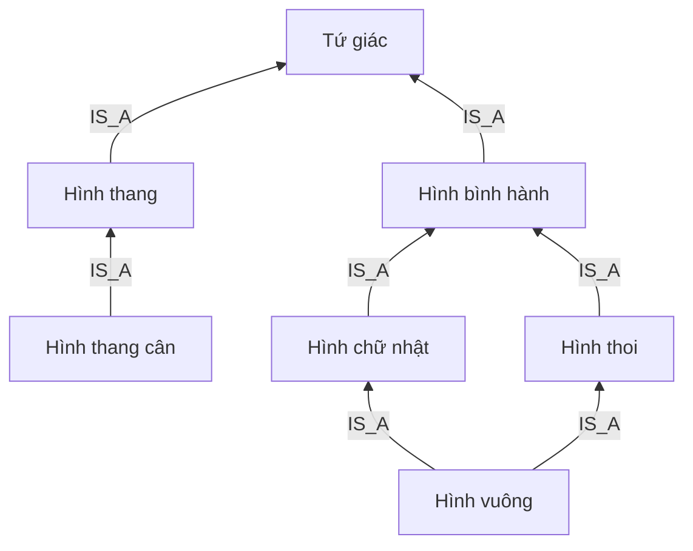

# PHASE 1 — PHÂN TÍCH VÀ THIẾT KẾ GRAPH

Đề tài: **Mô hình hoá – Tứ giác trong hình học phẳng với Neo4j**.

Phiên bản cập nhật ngày 06/10/2026 theo taxonomy được người dùng duyệt. Tài liệu này thay thế thiết kế phân loại trong câu trả lời Phase 1 trước đó. Đây là thiết kế; các kết quả truy vấn ghi trong tài liệu là **kết quả mong đợi, chưa phải kết quả chạy Neo4j**.

## 1. Phạm vi và đầu ra

Ứng dụng là graph tri thức về bảy loại tứ giác, tính chất hình học, quan hệ phân loại và dấu hiệu nhận biết. Neo4j là database chính. Flask và giao diện chỉ được triển khai sau Phase 2.

Ba đầu ra nộp giảng viên: tài liệu tổng quan DOCX; GitHub chứa Data + Source App; hướng dẫn sử dụng DOCX có ảnh kết quả thực tế. Chỉ chụp và chèn ảnh sau khi hệ thống chạy thật.

Không đưa nhận dạng ảnh, đo hình bằng tọa độ, đăng nhập hoặc hệ thống tự chứng minh định lý vào phạm vi hiện tại.

## 2. Quy ước toán học của taxonomy mới

Xét tứ giác lồi, phẳng, không suy biến. A, B, C, D là các đỉnh theo thứ tự quanh biên; đường chéo là AC và BD.

**Hình thang trong project có đúng một cặp cạnh đối song song.** Đây là quy ước phân loại tách nhánh, được chọn để taxonomy yêu cầu và định nghĩa không mâu thuẫn nhau. Nó thay thế quy ước “ít nhất một cặp” của Phase 1 trước. Không khẳng định đây là quy ước duy nhất trong mọi sách phổ thông; nếu đối chiếu một tài liệu dùng định nghĩa bao hàm, phải ghi rõ khác biệt.

Hình thang cân là hình thang có hai góc kề một đáy bằng nhau. Với hình thang ABCD, chọn AB và CD là hai đáy song song; AD và BC là hai cạnh bên. Các tính chất ở đáy/cạnh bên dùng cùng quy ước đỉnh này.

Hình bình hành có hai cặp cạnh đối song song nên không thuộc loại hình thang theo quy ước project. Hình chữ nhật không thuộc hình thang cân trong taxonomy này.

Hình vuông vẫn là hình chữ nhật và hình thoi. Không đặt điều kiện “không phải hình vuông” vào định nghĩa hình chữ nhật/hình thoi.

Định nghĩa bảy loại hình:

| ID | Tên | Định nghĩa trong project |
|---|---|---|
| TQ | Tứ giác | Đa giác lồi không suy biến có bốn cạnh trong mặt phẳng |
| HT | Hình thang | Tứ giác có đúng một cặp cạnh đối song song |
| HTC | Hình thang cân | Hình thang có hai góc kề một đáy bằng nhau |
| HBH | Hình bình hành | Tứ giác có hai cặp cạnh đối song song |
| HCN | Hình chữ nhật | Tứ giác có bốn góc vuông |
| HTHOI | Hình thoi | Tứ giác có bốn cạnh bằng nhau |
| HV | Hình vuông | Tứ giác có bốn cạnh bằng nhau và bốn góc vuông |

## 3. Node và ý nghĩa dữ liệu

Một node Shape đại diện cho **loại hình**, không phải một hình ABCD cụ thể có số đo. HAS_PROPERTY thể hiện tính chất đúng với mọi hình thuộc loại đó.

| Label | Vai trò | Thuộc tính |
|---|---|---|
| Shape | Loại tứ giác | id, name, definition, search_name, display_order, source_ref |
| Property | Mệnh đề dùng trong tính chất hoặc giả thiết | id, name, category, description, notation, source_ref |
| Condition | Một quy tắc nhận biết đầy đủ | id, name, statement, explanation, logic, source_ref |

Đề xuất thêm label chung ProjectEntity và trường dataset = 'quadrilateral-v1' cho mọi node của project. Đây là nhãn kỹ thuật để giới hạn phạm vi truy vấn/kiểm tra, không phải một khái niệm toán học hay loại node thứ tư.

Không tạo node Quadrilateral riêng trùng nghĩa với Shape TQ. ID ổn định; khóa hiển thị frontend ghép label và ID. Không dùng ID nội bộ Neo4j làm định danh nghiệp vụ.

## 4. Relationship

| Loại cạnh | Chiều | Ý nghĩa |
|---|---|---|
| IS_A | Shape → Shape | Loại nguồn là trường hợp đặc biệt của loại đích |
| HAS_PROPERTY | Shape → Property | Loại nguồn luôn có tính chất đích |
| HAS_CONDITION | Shape → Condition | Quy tắc đích đủ để nhận biết loại nguồn |
| REQUIRES_SHAPE | Condition → Shape | Ngữ cảnh hình ban đầu của quy tắc |
| REQUIRES_PROPERTY | Condition → Property | Giả thiết bổ sung phải thỏa mãn |

Chưa cần RELATED_TO vì không diễn tả ý nghĩa cụ thể. Chưa dùng IMPLIES; không triển khai suy luận logic tổng quát giữa các Property.

## 5. Taxonomy chính: đúng bảy cạnh



Các cặp ID: HTC→HT; HT→TQ; HBH→TQ; HCN→HBH; HTHOI→HBH; HV→HCN; HV→HTHOI.

Không có HBH→HT, HCN→HTC hoặc cạnh bắc cầu HV→TQ/HBH. IS_A là graph có hướng không chu trình. Hình vuông có đa kế thừa; hai nhánh gặp nhau tại HBH.

Tổ tiên của HV là **HCN, HTHOI, HBH, TQ**. Không có HT hoặc HTC. Đường phân loại dài nhất là ba cạnh.

## 6. Tính chất trực tiếp và kế thừa

Tính chất hiệu lực của s là tập Property gắn với chính s hoặc bất kỳ tổ tiên nào qua IS_A. Đây là quy tắc ứng dụng thực hiện bằng Cypher; Neo4j không tự suy luận ý nghĩa của IS_A.

Chỉ lưu khai báo ở lớp có trách nhiệm cung cấp tính chất; dùng DISTINCT khi tổng hợp vì HV tiếp cận HBH qua hai đường. HCN và HTC phải có hai cạnh HAS_PROPERTY riêng tới cùng Property DIAGONALS_EQUAL, vì hai nhánh không còn quan hệ kế thừa.

| Hình | Tính chất khai báo trực tiếp |
|---|---|
| TQ | FOUR_SIDES; ANGLE_SUM_360 |
| HT | EXACTLY_ONE_PARALLEL_PAIR; LEG_ADJACENT_ANGLES_SUPPLEMENTARY |
| HTC | LEGS_EQUAL; BASE_ANGLES_EQUAL; DIAGONALS_EQUAL |
| HBH | TWO_PARALLEL_PAIRS; OPPOSITE_SIDES_EQUAL; OPPOSITE_ANGLES_EQUAL; ADJACENT_ANGLES_SUPPLEMENTARY; DIAGONALS_BISECT_EACH_OTHER |
| HCN | FOUR_RIGHT_ANGLES; DIAGONALS_EQUAL |
| HTHOI | FOUR_EQUAL_SIDES; DIAGONALS_PERPENDICULAR; DIAGONALS_BISECT_ANGLES |
| HV | Không cần khai báo riêng; tổng hợp từ hai nhánh cha |

Đây là **17 cạnh HAS_PROPERTY** dự kiến. Không sao chép toàn bộ tính chất tổ tiên vào từng hình con.

Danh mục Property dự kiến:

| ID | Mệnh đề | Nhóm |
|---|---|---|
| FOUR_SIDES | Có bốn cạnh | cấu trúc |
| ANGLE_SUM_360 | Tổng bốn góc trong bằng 360° | góc |
| EXACTLY_ONE_PARALLEL_PAIR | Có đúng một cặp cạnh đối song song | cạnh |
| LEG_ADJACENT_ANGLES_SUPPLEMENTARY | Hai góc kề cùng một cạnh bên bù nhau, theo cặp đáy đã chọn | góc |
| LEGS_EQUAL | Hai cạnh bên bằng nhau, theo cặp đáy đã chọn | cạnh |
| BASE_ANGLES_EQUAL | Hai góc kề mỗi đáy bằng nhau | góc |
| DIAGONALS_EQUAL | Hai đường chéo bằng nhau | đường chéo |
| TWO_PARALLEL_PAIRS | Có hai cặp cạnh đối song song | cạnh |
| OPPOSITE_SIDES_EQUAL | Hai cặp cạnh đối bằng nhau | cạnh |
| OPPOSITE_ANGLES_EQUAL | Hai cặp góc đối bằng nhau | góc |
| ADJACENT_ANGLES_SUPPLEMENTARY | Mọi cặp góc kề nhau bù nhau | góc |
| DIAGONALS_BISECT_EACH_OTHER | Hai đường chéo cắt nhau tại trung điểm của mỗi đường | đường chéo |
| FOUR_RIGHT_ANGLES | Có bốn góc vuông | góc |
| FOUR_EQUAL_SIDES | Có bốn cạnh bằng nhau | cạnh |
| DIAGONALS_PERPENDICULAR | Hai đường chéo vuông góc | đường chéo |
| DIAGONALS_BISECT_ANGLES | Mỗi đường chéo phân giác các góc tại hai đầu của nó | đường chéo/góc |
| THREE_RIGHT_ANGLES | Có ít nhất ba góc vuông | góc |
| HAS_RIGHT_ANGLE | Có ít nhất một góc vuông | góc |
| ADJACENT_SIDES_EQUAL | Có một cặp cạnh kề bằng nhau | cạnh |

Ba Property cuối dùng làm giả thiết trong Condition, không phải orphan: chúng có cạnh REQUIRES_PROPERTY đi vào. Không khẳng định cơ chế IS_A tự suy ra THREE_RIGHT_ANGLES từ FOUR_RIGHT_ANGLES; phiên bản này tra cứu cấu trúc quy tắc, chưa phải bộ máy phân loại hình từ tập dữ kiện.

Nội dung tổng hợp cần hiển thị:

| Hình | Cạnh | Góc | Đường chéo |
|---|---|---|---|
| TQ | Bốn cạnh | Tổng góc 360° | Không có tính chất bằng nhau/vuông góc/chia đôi chung |
| HT | Đúng một cặp cạnh đối song song | Hai góc kề cùng cạnh bên bù nhau | Không gán tính chất bằng nhau/vuông góc/chia đôi cho mọi hình thang |
| HTC | Như HT; hai cạnh bên bằng nhau | Góc kề mỗi đáy bằng nhau | Bằng nhau |
| HBH | Hai cặp cạnh đối song song và bằng nhau | Góc đối bằng nhau; góc kề bù nhau | Chia đôi nhau |
| HCN | Kế thừa HBH | Bốn góc vuông | Bằng nhau và chia đôi nhau |
| HTHOI | Bốn cạnh bằng nhau; kế thừa HBH | Góc đối bằng nhau | Vuông góc, chia đôi nhau, phân giác các góc |
| HV | Kế thừa HCN và HTHOI | Bốn góc vuông | Bằng nhau, vuông góc, chia đôi nhau, phân giác các góc |

Nguồn tính chất DIAGONALS_EQUAL của HV bây giờ là **HCN**, không phải HTC. DIAGONALS_BISECT_EACH_OTHER đến từ HBH; DIAGONALS_PERPENDICULAR đến từ HTHOI.

Không lưu thuộc tính “không vuông góc” cho HCN hoặc “không bằng nhau” cho HTHOI: các lớp này bao gồm HV. Việc không tìm thấy Property không chứng minh mệnh đề phủ định.

## 7. Condition: AND trong một quy tắc, OR giữa các quy tắc

Mỗi Condition có logic='AND', đúng một REQUIRES_SHAPE, ít nhất một REQUIRES_PROPERTY và đúng một HAS_CONDITION đi vào từ hình kết luận. Tất cả giả thiết trong một Condition phải đồng thời đúng. Nhiều Condition của cùng Shape là các dấu hiệu đủ thay thế nhau (OR).

| ID | Hình kết luận | Ngữ cảnh | Property phải thỏa mãn |
|---|---|---|---|
| C_HT_01 | HT | TQ | EXACTLY_ONE_PARALLEL_PAIR |
| C_HTC_01 | HTC | HT | BASE_ANGLES_EQUAL |
| C_HTC_02 | HTC | HT | DIAGONALS_EQUAL |
| C_HBH_01 | HBH | TQ | TWO_PARALLEL_PAIRS |
| C_HBH_02 | HBH | TQ | OPPOSITE_SIDES_EQUAL |
| C_HBH_03 | HBH | TQ | OPPOSITE_ANGLES_EQUAL |
| C_HBH_04 | HBH | TQ | DIAGONALS_BISECT_EACH_OTHER |
| C_HCN_01 | HCN | TQ | THREE_RIGHT_ANGLES |
| C_HCN_02 | HCN | HBH | HAS_RIGHT_ANGLE |
| C_HCN_03 | HCN | HBH | DIAGONALS_EQUAL |
| C_HTHOI_01 | HTHOI | TQ | FOUR_EQUAL_SIDES |
| C_HTHOI_02 | HTHOI | HBH | ADJACENT_SIDES_EQUAL |
| C_HTHOI_03 | HTHOI | HBH | DIAGONALS_PERPENDICULAR |
| C_HV_01 | HV | HCN | ADJACENT_SIDES_EQUAL |
| C_HV_02 | HV | HCN | DIAGONALS_PERPENDICULAR |
| C_HV_03 | HV | HTHOI | HAS_RIGHT_ANGLE |
| C_HV_04 | HV | HTHOI | DIAGONALS_EQUAL |
| C_HV_05 | HV | TQ | FOUR_EQUAL_SIDES AND FOUR_RIGHT_ANGLES |

TQ là khái niệm gốc, không thêm Condition vô nghĩa. Với quy ước hình thang loại trừ, bỏ quy tắc cũ “hình thang cân có một góc vuông ⇒ hình chữ nhật”: hình thang cân như vậy sẽ có bốn góc vuông và hai cặp cạnh song song, trái định nghĩa HT của project.

Đồng thời, dưới quy ước mới, hình thang có hai cạnh bên bằng nhau là dấu hiệu đúng của hình thang cân. Có thể bổ sung sau; phiên bản cơ sở giữ hai dấu hiệu góc/đường chéo để tối giản. Phản ví dụ hình bình hành dùng trong Phase 1 cũ không còn là hình thang theo định nghĩa mới.

Condition không kế thừa qua IS_A. Một dấu hiệu nhận biết HBH không đủ kết luận HV. Không dùng các suy luận thiếu ngữ cảnh như “đường chéo bằng nhau ⇒ HCN” hoặc “đường chéo vuông góc ⇒ HTHOI”.

Ví dụ graph của quy tắc:

```text
HCN --HAS_CONDITION--> C_HCN_03
C_HCN_03 --REQUIRES_SHAPE--> HBH
C_HCN_03 --REQUIRES_PROPERTY--> DIAGONALS_EQUAL
```

## 8. Số lượng dự kiến của thiết kế cơ sở

7 Shape + 19 Property + 18 Condition = **44 node dự kiến**.

7 IS_A + 17 HAS_PROPERTY + 18 HAS_CONDITION + 18 REQUIRES_SHAPE + 19 REQUIRES_PROPERTY = **79 relationship dự kiến**.

Đây là số lượng theo bảng thiết kế, không phải thống kê database. Dashboard sau này phải đọc số thật từ Neo4j. Nếu thiết kế được điều chỉnh trong Phase 2, cập nhật lại các bảng và kết quả mong đợi trước khi kiểm thử.

## 9. Mười lăm truy vấn demo và kết quả mong đợi mới

Mọi truy vấn giới hạn dữ liệu quadrilateral-v1. Tổng hợp tính chất qua IS_A*0..6, bao gồm chính hình đang xét; DISTINCT loại trùng. Tìm tổ tiên dùng IS_A*1..6. Tìm lân cận phải giới hạn loại cạnh và độ sâu.

| Mã | Mục đích | Kết quả mong đợi |
|---|---|---|
| Q01 | Xem toàn bộ graph project | 44 node, 79 cạnh theo thiết kế; chưa phải số đã chạy |
| Q02 | Tất cả tính chất HV | 12 Property; danh sách bên dưới |
| Q03 | Cha trực tiếp HV | HCN, HTHOI |
| Q04 | Mọi tổ tiên HV | HCN, HTHOI, HBH, TQ; không có HT/HTC |
| Q05 | Trường hợp đặc biệt của HBH, không bao gồm chính HBH | HCN, HTHOI, HV |
| Q06 | Hình có bốn cạnh bằng nhau | HTHOI, HV |
| Q07 | Hình có bốn góc vuông | HCN, HV |
| Q08 | Hình có đường chéo bằng nhau | HTC, HCN, HV; HTC và HCN khai báo độc lập |
| Q09 | Mọi đường phân loại từ TQ tới HV | Hai đường ba cạnh: TQ←HBH←HCN←HV và TQ←HBH←HTHOI←HV |
| Q10 | Tính chất chung HV và HCN | 9 Property; danh sách bên dưới |
| Q11 | Tính chất chung HV và HTHOI | 10 Property; danh sách bên dưới |
| Q12 | Hình có đường chéo vuông góc AND chia đôi nhau | HTHOI, HV |
| Q13 | Số cạnh đi vào/ra của mỗi Shape, phân theo loại cạnh | So với bảng cạnh thiết kế; không cộng cạnh kế thừa như cạnh trực tiếp |
| Q14 | Graph lân cận của một Shape, độ sâu 1–3 | Tập node/cạnh đúng đường đi có giới hạn; không coi là tập tổ tiên IS_A |
| Q15 | Giải thích tính chất đường chéo chia đôi nhau của HV | Hai đường: HV→HCN→HBH→Property và HV→HTHOI→HBH→Property |

Q02: FOUR_SIDES, ANGLE_SUM_360, TWO_PARALLEL_PAIRS, OPPOSITE_SIDES_EQUAL, OPPOSITE_ANGLES_EQUAL, ADJACENT_ANGLES_SUPPLEMENTARY, DIAGONALS_BISECT_EACH_OTHER, FOUR_RIGHT_ANGLES, DIAGONALS_EQUAL, FOUR_EQUAL_SIDES, DIAGONALS_PERPENDICULAR, DIAGONALS_BISECT_ANGLES.

Q10: FOUR_SIDES, ANGLE_SUM_360, TWO_PARALLEL_PAIRS, OPPOSITE_SIDES_EQUAL, OPPOSITE_ANGLES_EQUAL, ADJACENT_ANGLES_SUPPLEMENTARY, DIAGONALS_BISECT_EACH_OTHER, FOUR_RIGHT_ANGLES, DIAGONALS_EQUAL.

Q11: FOUR_SIDES, ANGLE_SUM_360, TWO_PARALLEL_PAIRS, OPPOSITE_SIDES_EQUAL, OPPOSITE_ANGLES_EQUAL, ADJACENT_ANGLES_SUPPLEMENTARY, DIAGONALS_BISECT_EACH_OTHER, FOUR_EQUAL_SIDES, DIAGONALS_PERPENDICULAR, DIAGONALS_BISECT_ANGLES.

Q14 phải ghi rõ “lân cận”: đi không hướng qua Condition có thể thấy Shape ở nhánh khác. Điều đó không tạo quan hệ IS_A. Tổng hợp mọi tính chất vẫn dùng truy vấn riêng, vì đường tới Property của tổ tiên có thể vượt ba bước.

Chi tiết triển khai Q14: lấy tập node đạt được trong bán kính rồi hiển thị mọi cạnh nội bộ giữa các node đó (induced graph). Với tâm HV, kỳ vọng depth 1: 8 node/11 cạnh; depth 2: 23 node/43 cạnh; depth 3: 39 node/71 cạnh. Depth 1 có bảy cạnh nối tới HV và bốn cạnh ngữ cảnh nối các node lân cận với nhau. Không nhầm với graph hình sao chỉ có bảy cạnh tới tâm.

## 10. Vì sao dùng graph database

Nội dung cần chứng minh: đa kế thừa HV; truy vấn tổ tiên nhiều cấp; Property dùng chung giữa các nhánh; giao hai tập tính chất; đường đi giải thích nguồn gốc; quy tắc chứa nhiều giả thiết.

SQL cũng có thể làm bằng bảng liên kết và recursive CTE. Không tuyên bố Neo4j nhanh hơn trên dataset nhỏ khi chưa đo. Lợi ích chủ yếu là cách mô hình và truy vấn quan hệ phù hợp với bài toán và có thể trực quan hóa đường đi.

HAS_PROPERTY không chỉ phục vụ vẽ graph: nó tham gia truy vấn giao tính chất, lọc nhiều tính chất và truy xuất nguồn khai báo. Condition không chỉ là một đoạn văn: cạnh giả thiết cho phép kiểm tra độ đầy đủ và giải thích cấu trúc dấu hiệu nhận biết.

## 11. Màn hình và kiến trúc dự kiến

| Trang | Chức năng |
|---|---|
| / | Giới thiệu, quy ước toán học, thống kê thật, graph taxonomy |
| /shapes | Bảy loại hình, định nghĩa, tìm kiếm có dấu/không dấu |
| /shapes/<id> | Tính chất theo nhóm, nguồn kế thừa, điều kiện, cha/tổ tiên, graph |
| /queries | Danh mục 15 query, Cypher, tham số, kết quả thật và giải thích |
| /graph | Chọn hình trung tâm, độ sâu 1–3, lọc nhóm node, chú giải |

Trình duyệt HTML/CSS/JavaScript/vis-network → Flask routes → service/Cypher → Neo4j Python Driver → Neo4j. Không làm Flask/frontend trong Phase 2. Các tính chất và quan hệ được lấy từ database, không tái tạo graph giả trong frontend.

Mất kết nối thì báo lỗi rõ ràng. .env chứa cấu hình riêng; .env.example không có mật khẩu. Truy vấn động dùng tham số, không nối chuỗi. Query mẫu trên web có danh mục cố định; nhập Cypher tự do phục vụ demo kỹ thuật trong Neo4j Query/Browser.

## 12. Cấu trúc source dự kiến

```text
nosql/
├── app/                 # Phase 3–4
│   ├── routes/
│   ├── services/
│   ├── queries/
│   ├── templates/
│   └── static/
├── database/            # Phase 2
│   ├── constraints.cypher
│   ├── indexes.cypher
│   ├── seed.cypher
│   ├── demo_queries.cypher
│   └── validation.cypher
├── scripts/
├── tests/
├── docs/
│   ├── images/
│   ├── PHASE_1_PHAN_TICH.md
│   ├── TONG_QUAN_DU_AN.docx       # Phase 6
│   └── HUONG_DAN_SU_DUNG.docx    # Phase 6
├── .env.example
├── .gitignore
├── requirements.txt
├── README.md
└── run.py
```

Đây là cấu trúc dự kiến, không khẳng định các file đều đã được tạo.

## 13. Kế hoạch Phase 2 và điều kiện đạt

Trước thao tác database, cần xác nhận server đang chạy, thông tin xác thực, phiên bản Neo4j, database mục tiêu và phạm vi dữ liệu. Khi chưa có kết nối, dừng và hướng dẫn thiết lập theo yêu cầu người dùng.

Sau khi có kết nối, thực hiện đúng thứ tự:

1. Tạo constraints.cypher: uniqueness (dataset, id) cho Shape, Property, Condition; IF NOT EXISTS. ID duy nhất trong từng label của dataset; không áp đặt ID toàn cục lên các dataset khác.
2. Tạo indexes.cypher: index search_name phục vụ tìm tiền tố; tránh index trùng với index được constraint tạo.
3. Chốt đầy đủ danh mục Property, mô tả, ký hiệu và nguồn.
4. Chốt đầy đủ Condition, giả thiết AND và các phương án OR.
5. Tạo seed.cypher bằng MERGE và ID ổn định.
6. Seed bảy Shape.
7. Seed Property.
8. Seed Condition.
9. Seed relationship bằng MERGE giữa node đã xác định.
10. Tạo demo_queries.cypher với 15 query, mục đích và kết quả mong đợi.
11. Tạo validation.cypher.
12. Chạy kiểm tra trùng ID/trùng cạnh, orphan, self-loop, chu trình IS_A, cạnh sai kiểu, thiếu trường, Condition thiếu/thừa ngữ cảnh/kết luận, taxonomy thừa/thiếu. Kiểm tra hai cạnh bị loại phải không tồn tại trong project.
13. Seed lại lần hai; đối chiếu cả số lượng, tập ID, các cặp cạnh và thuộc tính để kiểm tra idempotent.
14. Chạy từng query trên Neo4j thật; so tập kết quả đã loại trùng, đường đi và nguồn tính chất với bảng kỳ vọng; ghi phiên bản/môi trường/kết quả và lỗi nếu có.

Không xóa database hoặc dữ liệu ngoài project. Seed không chứa DETACH DELETE/DROP DATABASE. Nếu cần xử lý cạnh cũ của project, phải xác định phạm vi và migration cụ thể; MERGE không tự xóa cạnh cũ.

Uniqueness không thay thế kiểm tra trường bắt buộc, chu trình hoặc quan hệ sai kiểu. Property chỉ dùng cho Condition vẫn phải được tính là có liên kết, không bị báo orphan nhầm. HV không có HAS_PROPERTY riêng vẫn có IS_A/HAS_CONDITION, nên không phải orphan.

Chỉ chuyển Phase 3 sau khi kết nối, seed hai lần, validation và toàn bộ 15 query đều đạt thực tế.

## 14. Tự đánh giá Phase 1

Taxonomy có bảy cạnh đúng theo yêu cầu. HV vẫn đa kế thừa. HCN tự khai báo DIAGONALS_EQUAL nên việc bỏ nhánh HTC không làm mất tính chất. Condition không kế thừa; AND/OR rõ ràng. Quy ước hình thang đã đổi và dấu hiệu không phù hợp đã bỏ. Query kỳ vọng đã cập nhật, đặc biệt Q04/Q09/Q15. Không dựa vào Property chung hoặc Condition để kết luận quan hệ phân loại.

## 15. Nguồn tham khảo

- Neo4j Cypher patterns: https://neo4j.com/docs/cypher-manual/current/patterns/
- Neo4j constraints: https://neo4j.com/docs/cypher-manual/current/schema/constraints/create-constraints/
- Neo4j Python Driver: https://neo4j.com/docs/python-manual/current/query-simple/
- MathWorld Parallelogram: https://mathworld.wolfram.com/Parallelogram.html
- MathWorld Rectangle: https://mathworld.wolfram.com/Rectangle.html
- MathWorld Rhombus: https://mathworld.wolfram.com/Rhombus.html
- MathWorld Isosceles Trapezoid: https://mathworld.wolfram.com/IsoscelesTrapezoid.html

Các tài liệu có thể dùng định nghĩa hình thang khác nhau; định nghĩa loại trừ trong mục 2 là quy ước được áp dụng cho project.

## 16. Trạng thái triển khai Phase 2

Đã triển khai và kiểm thử trên Neo4j Enterprise 2026.09.0, database riêng quadrilateral. Các bảng ở trên vẫn là đặc tả/kỳ vọng; kết quả chạy thật, seed hai lần và validation được lưu riêng trong PHASE_2_RESULTS.json và BAO_CAO_PHASE_2.md. Schema dùng constraint composite (dataset,id) và index (dataset,search_name). Chưa làm Flask/frontend.
